# Activity 2

- Date: *2025-01-15*
- Author: **Ashley Barron**

# Introduction
- This activity will include: 
     - Creating Models, Views, & Controllers using Spring Model View Controller (MVC)
     - Creating forms with Data Validation Using Spring MVC
     - Creating Layouts Using Thymeleaf

# Screenshots

- This is a screenshot of the MVC test screen 1

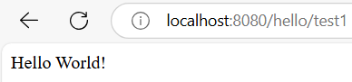
 

- This is a screenshot of the MVC test screen 2

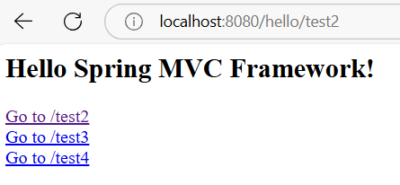
 

- This is a screenshot of the MVC test screen 3

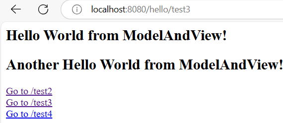
 

- This is a screenshot of the MVC test screen 4

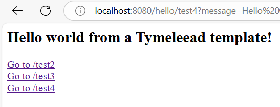
 

- This is a screenshot of the MVC test screen with the welcome message

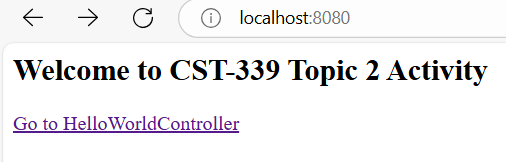
 

### Part 2: Creating Forms with Data Validation Using Spring MVC

- This is a screenshot of the Login Forms with no data validation

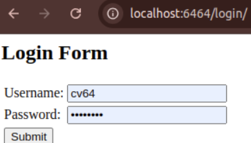
 

- This is a screenshot of the Login Form posted values in the Console Window
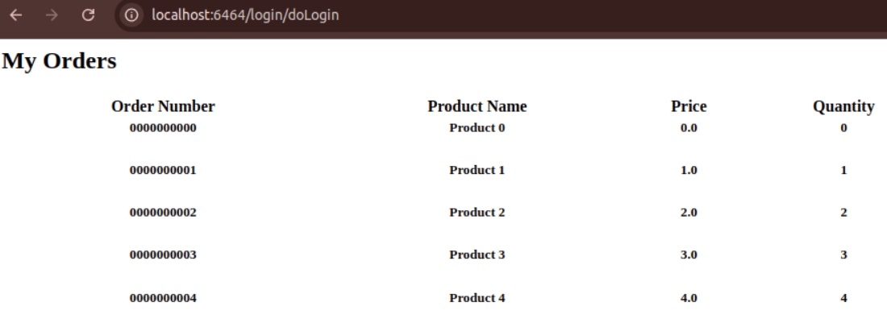
 

- This is a screenshot of the Login Form with data validation errors
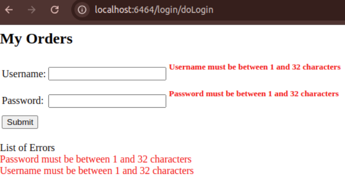
 

- This is a screenshot of the My Orders Console Page
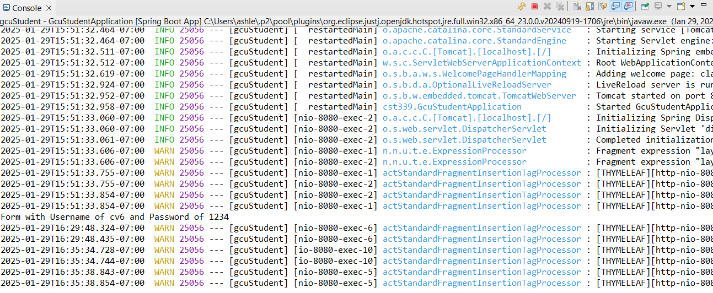
 

### Part 3 Creating Layouts Using Thymeleaf

- [GCU Logo](https://gitlab.com/bobby.estey/gcuStudent/-/raw/main/src/main/resources/static/images/gcu-logo.png)

- This is a screenshot of the Login Page
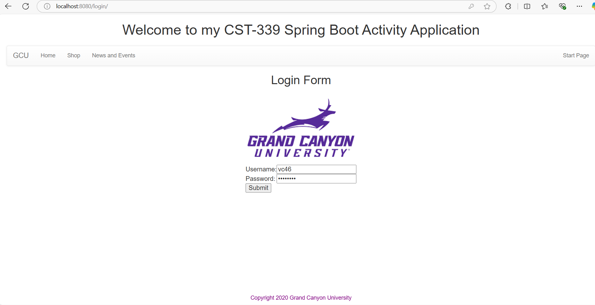
 

- This is a screenshot of the Orders Page
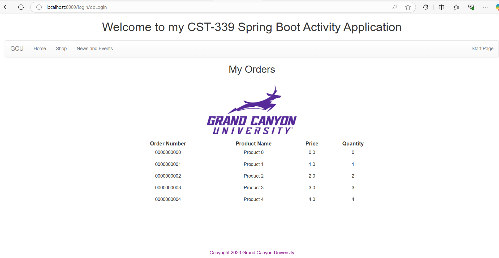
 

# Research Questions
### Questions 
1. How does Spring MVC support the MVC design pattern? 
Draw a diagram that supports the answer to this question.

2. Research and identifty 2 MVC Frameworks other than Spring 
MVC. What are the frameworks and how do they differ from 
Spring MVC. 

### Answers
1. A spring MVC is a Java-based framework used for building web applications.
It follows the Model-View-Controller(MVC) design pattern, which separates the 
application into three components. 
    - The model represents the data and business logic of the application. 
    In Spring MVC, the model is implemented using plain Java objects or entilies.
    The @ModelAttribute annotation helps bind data between the view and model.
    Service and repository layers can also act as a part of the model to take care
    of the business logic and data access. 

    - The View represents the presentation layer, typically using thymeleaf, or JSP.
    In Spring MVC, the view is implemented with numerous templating engines giving 
    flexibility in designing the user interface. Frequently using the ViewResolver, 
    the controller selects the appropriate view to render. 

    - The Controller takes care of of the user requests, interacts with the model,
     and chooses which view to render. 
     In Spring MVC, the @Controller or @RestController annotations are mainly used 
     to define controllers. Methods within controllers are annotated with @RequestMapping
      or @PostMapping to map HTTP requests to handler methods. 

### Diagram:
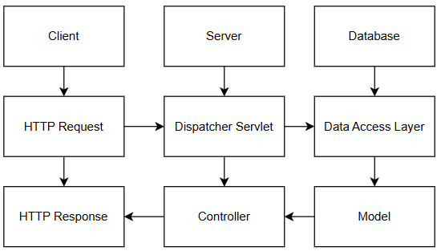

2. Two MVC frameworks other than Spring MVC are Yii and Zend. 
    Yii is a PHP-based framework that focuses on reducing SQL usage and offers strong security 
    and unit-testing features. It emphasizes efficiency  through tools like  
    Active Record and query builders. These features make Yii ideal for rapid development, 
    allowing developers to build applications quickly while ensuring strong security and testability.     
     
    Zend is a modular, enterprise-focused PHP framework designed for flexibility 
    and scalability. It has a steeper learning curve due to its highly customizable, 
    component-based architecture, making it more suited for complex, large-scale 
    applications. Zend's modular nature allows developers to use only the components 
    they need, which is especially beneficial for enterprise-level applications but 
    can be challenging for beginners.

# Conclusion
- In conclusion, Spring MVC is a Java-based framework that utilizes the Model-View-controller(MVC) 
design pattern to separate an application into three key components: the model, view, and controller.
The model takes care of data and business logic, the view manages the presentation layer, and the controller 
interacts with annotations such as @ModelAttribute, @Controller, and @RequestMapping to streamline development. 

- In comparison, Yii and Zend are PHP-based MVC frameworks that cater to different needs. Yii focuses on 
efficiency, reducing SQL usage, and providing strong security and unit-testing features, making it ideal for 
rapid development. Zend, on the other hand, is more suited for large-scale, enterprise applications. 
It offers flexibility and scalability but requires a steeper learning curve due to its customizable, 
component-based architecture. Both frameworks offer unique benefits depending on the scale and 
complexity of the project. 