# Activity 3

- Date: *2025-2-10*
- Author: **Ashley Barron**

## Introduction
- This activity will provide the following:
    - Configure an application to use the Spring Core framework
    - Design and build Spring Beans using the Spring Core framework
    - Leverage the IoC container in the Spring Framework in support of applying the dependency injection design pattern
    - Design and develop REST API's using the Spring MVC/Spring Data REST and Spring Core frameworks

## Screenshots
### Part 1: Creating Modles, Views, and Controllers Using Spring MVC 
- This is a screenshot of the interface being called
 

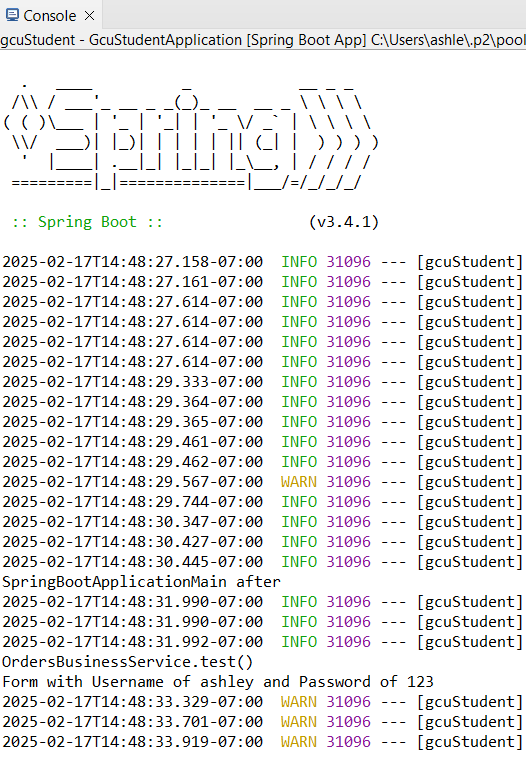

- This is a screenshot of the Another Interface being called
 

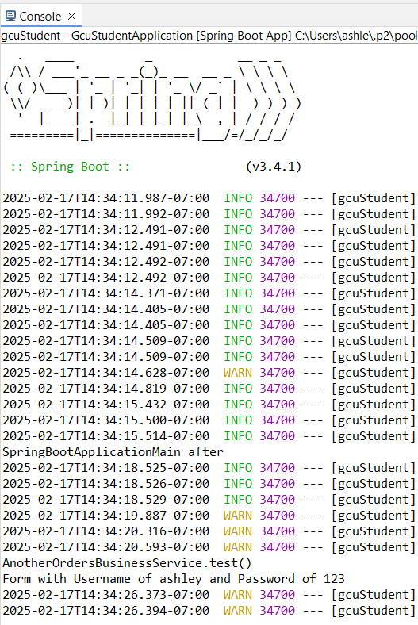

- This is a screenshot of the Authenticate being called
 

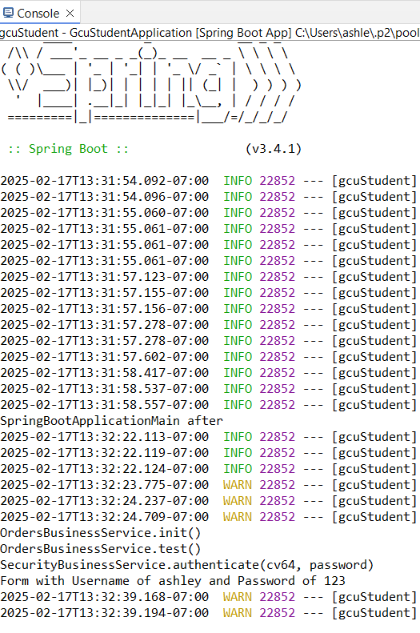

- This is a screenshot of the Orders page
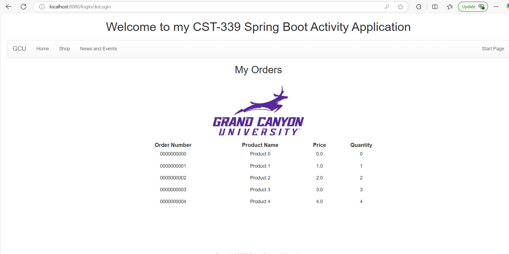

### Part 2:  Spring Bean Life Cycle and Scopes
- This is a screenshot of the init method call
- The init method was added in the "OrdersBusinessService" and "AnotherOrdersBusinessService" classes after it was first declared in the "OrdersBusinessServiceInterface". We also had to modify the @Bean section in the "SpringConfig" class to make sure that the correct implementation was used. The number of times that the init method was called depends on how many times the corresponding beans were instantiated. 
 

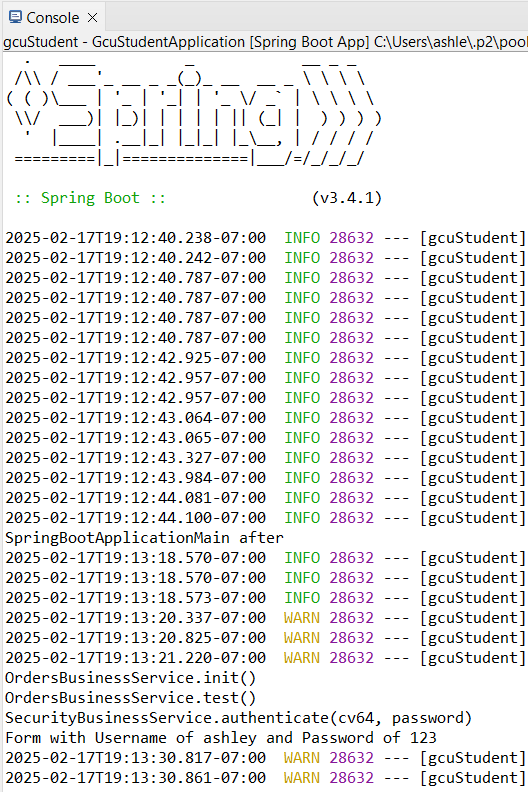

- This is a screenshot of the @RequestScope annotation.
- The init() method is called each time the program is executed or when the page is refreshed. The number of times it's called depends on how many times the site is refreshed or how many instances are initialized during the program's runtime.
 

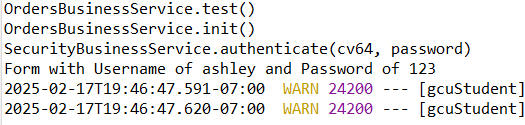

- This is a screenshot of the @sessionScope annotation.
- Just as with the rest of the screenshots, the number of times the init() method appears depends on how many times the site is refreshed. Each time the page is reloaded, the init() method is called to initialize the page. This makes sure that any necessary setup for the page, such as setting default values, is performed and that the code behaves as intended with each new session or reload.
 

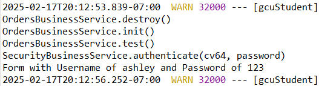

### Part 3:  Creating REST Services Using Spring REST Controllers
- This is a screenshot of the JSON response
 

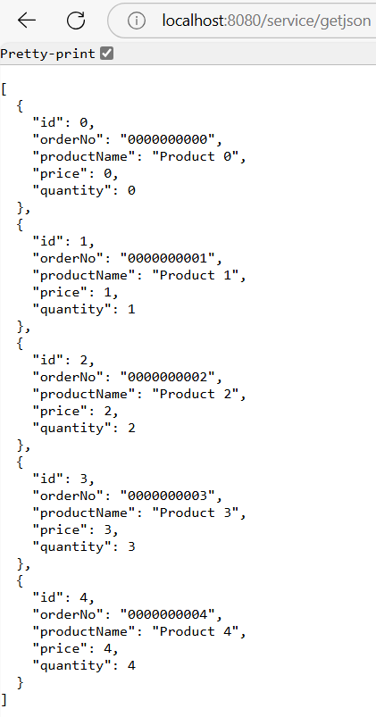

- This is a screenshot of the XML response
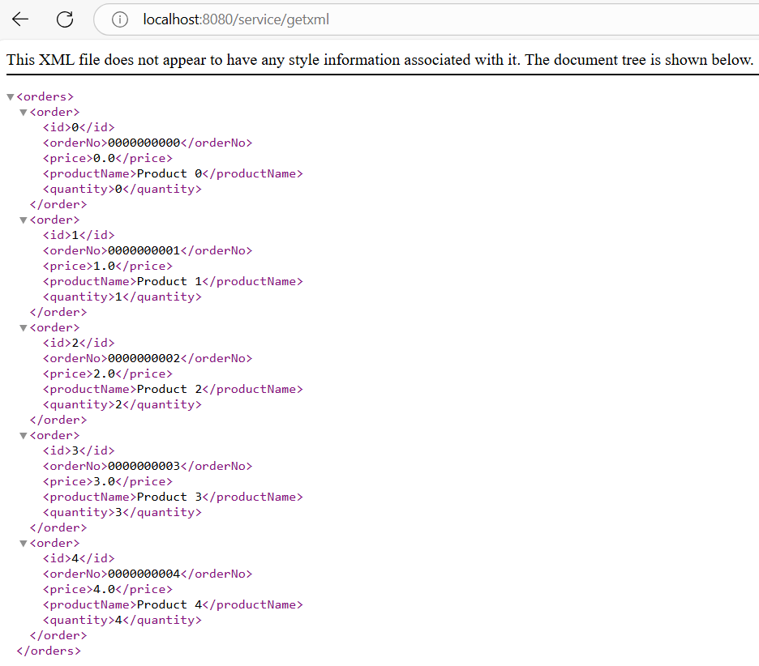

- This is a screenshot of the Postman JSON response
 

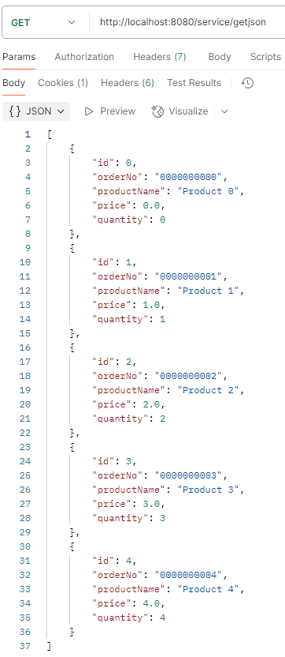

- This is a screenshot of the Postman XML response
 

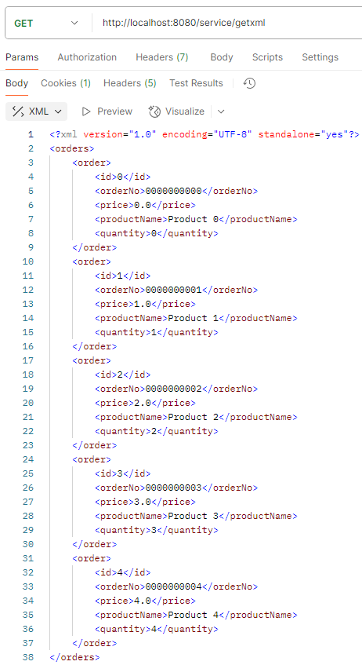

## Research Questions

### Questions
1. What is the difference between the @Component, @ Service, and @Bean 
annotations? When would you use one versus the other?

2. Why does an Inversion of Control (IoC) Container force you to design and 
code to interface contracts?

### Answers
1.
    - @Component is a class-level annotation used to mark a class as a Spring-managed Component. 
    It allows Spring to detect and manage the class as a bean through component scanning. 
    This annotation is ideal for generic components that encapsulate reusable operations, such as utility classes.  

    - @Service is a specialization of @Component, specifically used for classes containing business logic. It conceptually belongs to the 
    service layer. Marking as a class with @Service makes your code more readable and organized, clearly indicating its 
    purpose. Spring will autodetect these classes when using annotation-based configuration. For instance, 
    you might annotate a payment service class with @service to manage payment processing logic.
    
    - @Bean is used to declare a single bean explicitly when automatic component scanning is 
    insufficient. It decouples the declaration of the bean from the class definition, allowing 
    you to create and configure beans as needed. @Bean is typically used inside a @Configuration 
    class and is useful for integrating third-party libraries or defining beans with custom 
    initialization logic. For example, you might use @Bean to define a custom instance of an external DataSource object. 

2. 
    - By programming to interfaces, you can create code that is more modular and 
    flexible, making it easier to adapt and extend in the future. The IoC container enforces this approach by managing object creation and dependencies, 
    allowing you to inject different implementations of an interface at runtime without 
    changing the dependent classes. This leads to better decoupling between components and 
    allows for easy replacement or enhancement of functionality. To maintain a clear separation 
    of concerns, it's important to keep the IoC container configuration separate from your business logic. 
    This separation ensures that your business logic remains focused on the application's core functions, 
    while the IoC container takes care of managing object dependencies and their lifecycle. 

## Rest API design Report
### API Specification Doc
#### (Orders App)
-----------------
|**Version**|**Date**|**Author**|**Description**|
|----------|------------|
|1.0| 19-Feb-2025 | Ashley Barron | Initial draft|

## Index
1. User Authentication
    - Login
2. Orders
    - Get Orders
    - Put Orders
    - Delete Orders

## Methods
#### User Authentication

## 1. login
Authenticate the user with the system and obtain the auth_token

### Request
-----------------
|**Method**|**URL**|
|----------|------------|
|POST| api/login/ |

-----------------
|**Type**|**Params**|**Values**|
|----------|------------|------------|
|Head| api_key | string |
|POST| username | string |
|POST| password | string |

#### api_key
- api_key  must be sent with all client requests. The api_key helps the server to validate the request source.

### Response
-----------------
|**Status**|**Response**|
|----------|------------|
|200| { "auth_key": <auth_key> } auth_key (string) - all further API calls must have this key in header |
|403| {"error":"API key is missing."}|
|400| {"error":"Please provide username."}|
|400| {"error":"Please provide password."}|
|401| {"error":"Invalid API key."}|
|401| {"error":"Incorrect username or password."}|
|500| {"error":"Something went wrong. Please try again later."}|

## 2. get Orders
Get the new orders
### Request
-----------------
|**Method**|**URL**|
|----------|------------|
|Get| api/orders/ |

-------------------------------
|**Type**|**Params**| **Values**|
|----------|------------|------------|
|Head| auth_key | key |

#### auth_key
- The  auth_key  that was given in response to /api/login

#### version
- The current version of internal order database. Each time when updates are pulled from the server through the web service, the internal database version is incremented.

### Response
-------------------------------
|**Status**|**Response**|
|----------|------------|
|200| { id": 0,    "orderNo": "0000000000",    "productName": Product 0",    "price": 0,    "quantity": 0  }|
|400| {"error":"Please specify database version."}|
|400| {"error":"Invalid database version."}|
|401| {"error":"Invalid API key."}|
|500| {"error":"Something went wrong. Please try again later."}|

## 3. Place Order
Get the orders from the web interface, so that they can be placed in the internal database.

### Request
-----------------
|**Method**|**URL**|
|----------|------------|
|Post| api/orders/ |

-------------------------------
|**Type**|**Params**| **Values**|
|----------|------------|------------|
|Head| auth_key | key |
|Post| id | number |
|Post| quantity | number|

#### version
The current version of the internal database. Each time when updates are pulled from the API, the internal database version increases.

### Response
-------------------------------
|**Status**|**Response**|
|----------|------------|
|200| {    "id": 1,    "orderNo": "0000000001",    "productName": "Product 1",    "price": 1 "quantity": 1}|
|400| {"error":"Please specify database version."}|
|400| {"error":"Invalid database version."}|
|401| {"error":"Invalid API key."}|
|500| {"error":"Something went wrong. Please try again later."}|

## 4. Delete Order
Delete order by id
### Request
-----------------
|**Method**|**URL**|
|----------|------------|
|Delete| api/orders/<orderNo>/ |

-------------------------------
|**Type**|**Params**| **Values**|
|----------|------------|------------|
|Head| auth_key | key |

## orderNo
Id of the order.

### Response
-----------------
|**Status**|**Response**|
|----------|------------|
|200| { "message": "Order deleted successfully." } |
|400| {"error":"Please provide orderNo."} |
|400| {"error":"Invalid order."} |
|401| {"error":"Invalid Auth key."} |
|500| {"error":"Something went wrong. Please try again later."} |

## Glossary
#### Conventions
- Client - Client application.
- Status - HTTP status code of response.
- All the possible responses are listed under ‘Responses’ for each method. Only one of them is issued per request server.
- All response are in JSON format.
- All request parameters are mandatory unless explicitly marked as [optional]
- The type of values accepted for a request parameter are shown the the values column like this [10|<any number>] .The | symbol means OR. If the parameter is [optional], the default value is shown in blue bold text, as 10 is written in [10|<any number>].

## Status Codes
All status codes are standard HTTP status codes. The below ones are used in this API.

- 2XX - Success of some kind
- 4XX - Error occurred in client’s part
- 5XX - Error occurred in server’s part
-------------------------------
|**Status Description**|**Description**|
|----------|------------|
|200|ok|
|201|Created|
|202|Accepted (Request accepted, and queued for execution)|
|400|Bad request|
|401|Authentication failure|
|403|Forbidden|
|404|Resource not found|
|405|Method Not Allowed|
|409|Conflict|
|412|Precondition Failed|
|413|Request Entity Too Large|
|500|Internal Server Error|
|501|Not Implemented|
|503|Service Unavailable|

## Conclusion
- In conclusion, @Component is a class-level annotation that designates a class as a Spring-managed component. 
@Service is a specialized version of @Component that's used for classes that handle business logic, organization, and improving code readability.
@Bean is used to define a single bean when automatic component scanning is insufficient, typically within a @Configuration class. 
By programming to interfaces, developers create more adaptable and modular code, making future modifications and extensions easier.
The IoC container manages object creation and dependencies, ensuring a clear separation between business 
logic and IoC container configuration, leading to better flexiblity and maintainability. 
