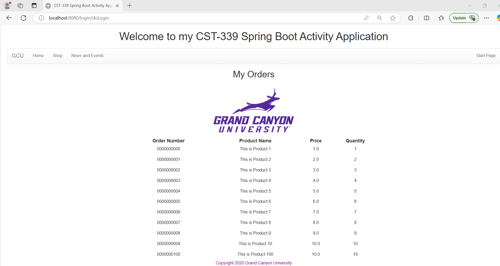
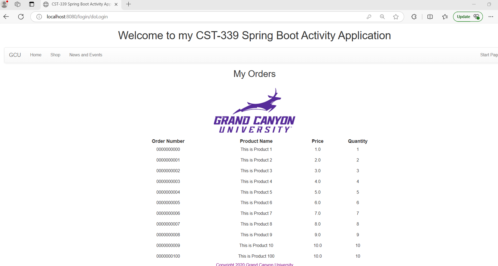
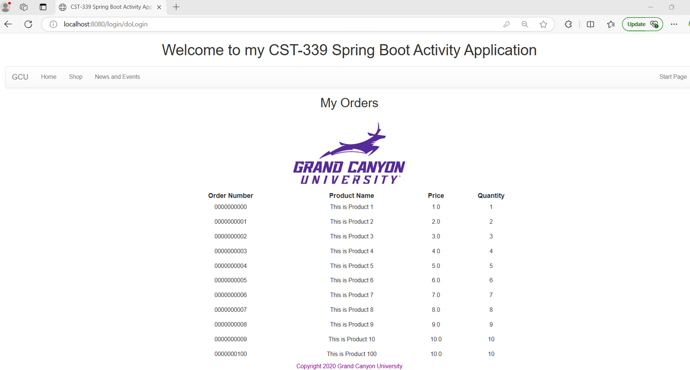

# Activity 4

- Date: *2025-3-6*
- Author: **Ashley Barron**

# Introduction
- This activity will provide the following:
    - Configure an application to use Spring Data Java Database Connectivity (JDBC)
    - Persist data using the Data Access Object (DAO)/Repository design pattern to a relational database using Spring Data JDBC

# MySQL Configuration

# src/main/resources/application.properties
```
spring.datasource.url=jdbc:mysql://localhost:3306/cst339
spring.datasource.username=sqluser
spring.datasource.password=password
spring.datasource.driver-class-name=com.mysql.cj.jdbc.Driver
```
* Open up MySQL Workbench
* Select Create a new SQL tab for executing queries
* First Icon with SQL Header and Plus "+" under Menu Item File

*PIC!*

* Copy and Paste (CST-339-RS-Activity4-MySQL2.txt) in SQL screen
* Press Lightning Bolt without the cursor

*PIC!*

* Create a new Query
* Select Create a new SQL tab for executing queries
* Type: SELECT * FROM cst339.ORDERS;
* Press Lightning Bolt without the cursor
* Validate Table was populated with Data

*PIC!*

# Screenshots
### Part 1:  Creating Data Services Using Spring JDBC

- This is a screenshot of the orders page where it shows an updated version of the order number, product name, price, and quantity. 

### Part 2:  Creating Data Services Using Spring Data JDBC

- This is a screenshot of the orders page for part 2. 

### Part 3:  Creating Data Services Using Spring Data JDBC Native Queries

- This is a screenshot of the orders page for part 3. 

## Research Questions - located in Activity Guide

1. How does Spring Data JDBC differ from standard Java JDBC programming?

2. How does Spring Data JDBC support transaction management and the ACID principle?

## Research Answers

1. Spring JDBC has connectivity with any one of jars RDMS such as MyQSL, Oracle, or SQL Server, through the use of JDBC drivers and JDBC Template. 
On the other hand, Spring Data JDBC belongs to the Spring Data family. It provides astractions from JDBC-data based Data Access Layer. 
One of the differences is the integration with the Spring Framework. 
Although Spring JDBC offers a way of managing database connections and running SQL queries, it isn't completely integrated into the Spring Framework. 
While Spring JDBC doesn't offer the same smooth integrtion as Spring Data JDBC, one may still leverage Spring's dependancy injection and transaction management features. 
As a member of the Spring Data Family, Spring Data JDBC is made to closely work with Spring's configuration, dependency injection, and transaction management technologies. By using the best practices of the Spring ecosystem, this enabled better creation and improved management of database connections and transactions. 

2. The @Transactional annotation in Spring is used by Spring Data JDBC to handle transactions. It supports declarative transaction management, which means that depending on whether a method is successful or unsuccessful, transactions are automatically started, committed, or rolled back. It also supports for isolation and propagation levels, giving smooth control over transaction behavior. Data from Spring JDBC guarantees that, in the even of an error, every operation in a transaction is either fully rolled back or fully completed. The framework guarantees data integrity, even in the event of a transaction failure and makes sure the database retains valid state through constraints. To prevent concurrent issues, it provides isolation levels such as READ_COMMITED. Even in the event of a system failure, changes made to a transaction are irreversible once they're committed. 

# Conclusion
- In conclusion, Spring Data JDBC offers a better level of interaction with the Spring Framework, though both Spring JDBC and Spring Data JDBC allow database connectivity. Through JDBC drivers and templates, Spring JDBC makes database interactions easier. However, it doesn't integrate seamlessly like Spring Data JDBC, which makes use of Spring's dependency injection and transaction management to improve efficiency. 
Additionally, by using @Transactional to handle rollbacks, commits, and data integrity automatically, Spring Data JDBC guarantees strong transaction management. With support for isolation and propagation levels, it successfully prevents concurrency problems, which makes it a more efficient and dependable option for handling database operations inside the Spring environment. 
