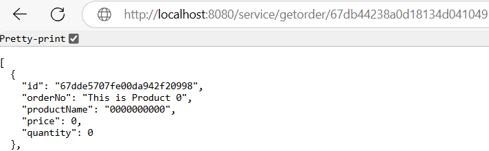
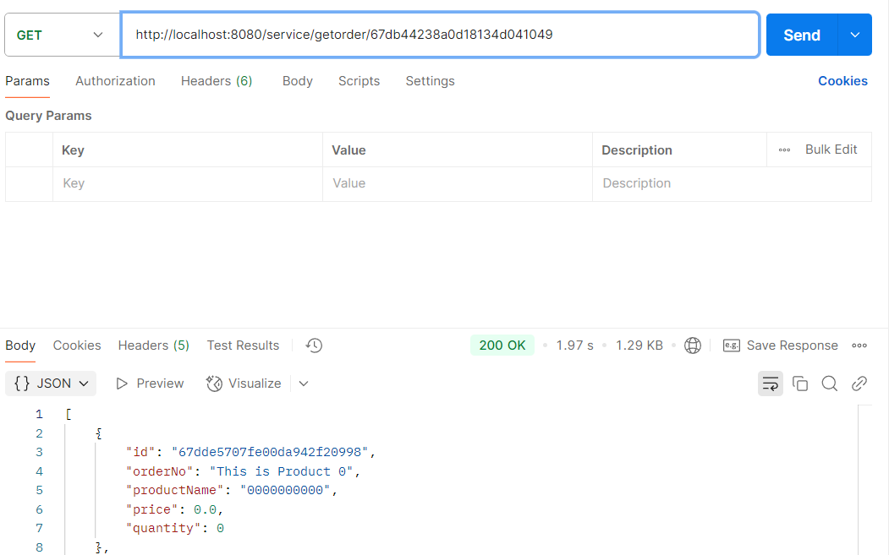
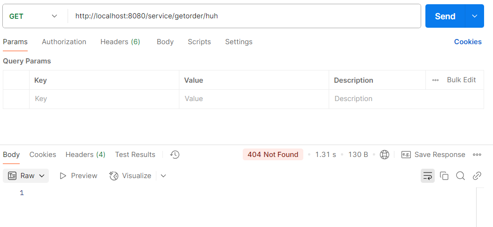

# CST-339 Activity 5

- Date: *2025-3-21*
- Author: **Ashley Barron**

## Introduction
- This activity will provide the following:
    - Configure an application to use Spring Data MongoDB
    - Persist data using the Data Access Object (DAO)/Repository design pattern to a non-relational database using Spring Data MongoDB

## MongoDB
- MongoDB Installation and Configuration
- MongoDB Database Procedures

## Screenshots
### Part 1: Creating Data Services Using Spring Data MongoDB
- This is a screenshot of the Orders Page.

- This is a screenshot of the JSON Page

- This is a screenshot of the XML Page

### Part 2: Adding New Queries in the MongoDB Repository
- This is a screenshot of getOrder of a good ID in the Browser

- This is a screenshot of getOrder of a good ID in Postman

- This is a screenshot of getOrder of a bad ID in the Browser

- This is a screenshot of getOrder of a bad ID in Postman

## Research Questions
### Questions
1. Compare and contrast the design of schema in a relational database and a nonrelational database. How do they differ and what impact(s) does migrating from a relational database to a nonrelational database have on your application design?

2. Compare and contrast the features of a relational database and a nonrelational database. Provide three advantages and rationale for why you would select a relational database. Provide three advantages and rationale for why you would select a nonrelational database.

### Answers
1. Relational databases use foreign and main keys to maintain relationships while storing data in structured tables with specified schemas. Since it guarantees ACID compliance, it's ideal for applications that need complex SQL queries and high consistency. On the other hand, a non-relational database stores data in formats such as documents, graphs or key-values pairs, and offers flexible schemas. It often sacrifices strict consistency in favor of efficiency and scalability. Moving from relational to NoSQL requires rewriting queries, restructing data models, and adjusting to new consistency methods. Although, NoSQL increases scalability and flexibility, it needs modifications in data integrity management, application logic, and indexing. 

2. Relational databases use SQL for queries and aranging data into tables with specified schemas. By using foreign and primary keys to strengthen links across tables, they ensure data integrity and facilate complex, structured queries. However, non-relational databases could manage semi-structured or unstructured data since the provide more flexible schemas and store data in a variety of formats such as graphs or documents. Relational databases give three benefits which are data integrity, structured capabilities, and high consistency. Data integrity enforces restrictions to ensure valid data, structured query capabilities enables difficult searches for accurate analysis, and high consistency ensures acurate and dependable transactions. Yet, non-relational databases provide faster performance, high scalability, and flexible data modeling. The faster performance optimizes read and write operations for bigger volumes of data, high scalability easily handles large datasets by providing data across servers, and flexible data modeling allows quick changes to data structures without disruption. The requirements of the application will determine which of the two is best, NoSQL is more suitable for managing large dynamic datasets with changing structures, while relational databases are best for structured, consistent data. 

## Conclusion
- In conclusion, this activity gave hands on experience integrating Spring Data MongoDB into an application and showing them how to use the DAO repository design pattern. We developed a better understanding of how non-relational databases work inside a Spring Biit application by setting up MongoDB, putting data services into place, and adding new queries. The importance of appropriate error handling and response status management was further emphasized by testing the API responses in a browser and postman. In order to evaluate the relative benefits of relational and non-relational databases based on the requirements of the application, the research component also highlighted the main differences between the two types of databases. Overall, this activty improved our understanding of MongoDB, database architecture, and API development, which are essential skills for working with modern, scalable applications, 
