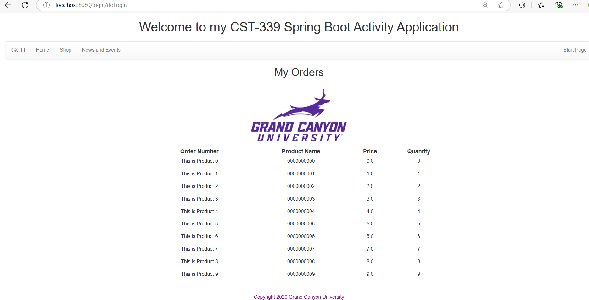
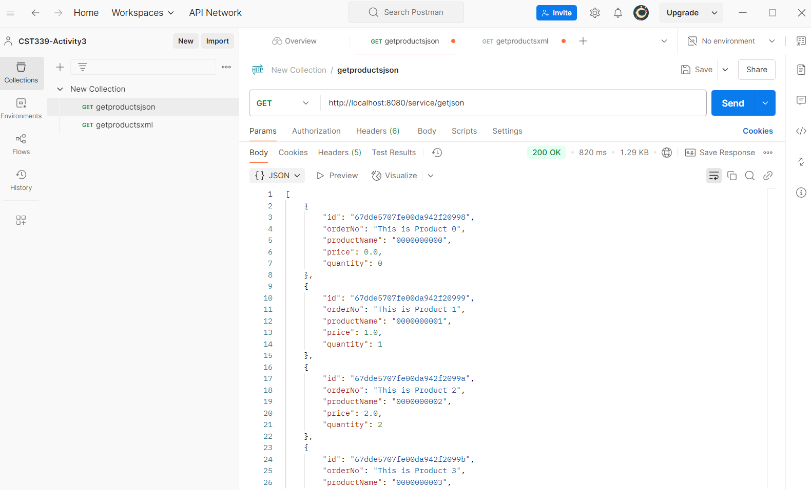
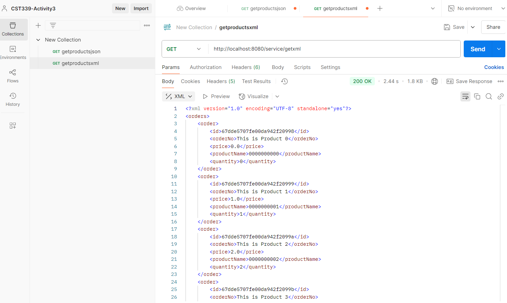

# CST-339 Activity 5

- Date: *2025-3-21*
- Author: **Ashley Barron**

## Introduction
- This activity will provide the following:
    - Configure an application to use Spring Data MongoDB
    - Persist data using the Data Access Object (DAO)/Repository design pattern to a non-relational database using Spring Data MongoDB

## MongoDB (*Links?**)
- MongoDB Installation and Configuration
- MongoDB Database Procedures

## Screenshots
### Part 1: Creating Data Services Using Spring Data MongoDB
- This is a screenshot of the Orders Page.

- This is a screenshot of the JSON Page

- This is a screenshot of the XML Page

### Part 2: Adding New Queries in the MongoDB Repository
- This is a screenshot of getOrder of a good ID in the Browser
*Pic*

- This is a screenshot of getOrder of a good ID in Postman
*Pic*

- This is a screenshot of getOrder of a bad ID in the Browser
*Pic*

- This is a screenshot of getOrder of a bad ID in Postman
*Pic*

## Research Questions
### Questions
1. Compare and contrast the design of schema in a relational database and a nonrelational database. How do they differ and what impact(s) does migrating from a relational database to a nonrelational database have on your application design?

2. Compare and contrast the features of a relational database and a nonrelational database. Provide three advantages and rationale for why you would select a relational database. Provide three advantages and rationale for why you would select a nonrelational database.

### Answers
1. *hfb
2. *bff

## Conclusion
- *ucdhf