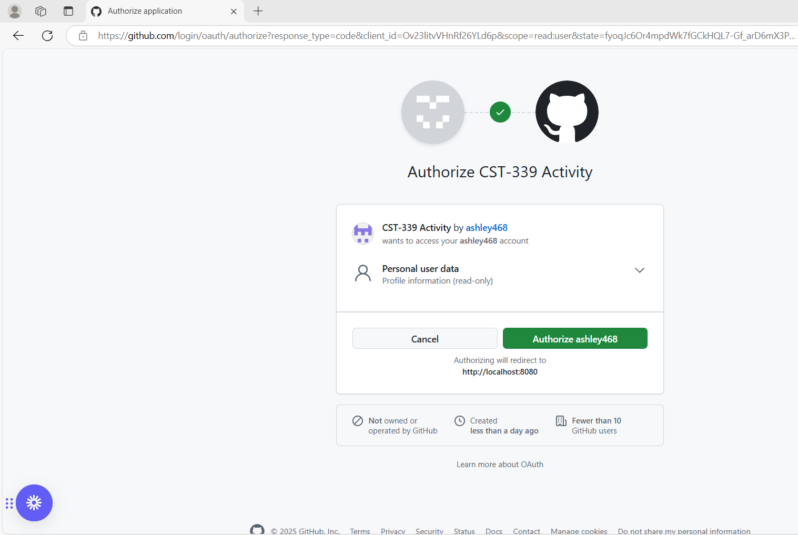

# Activity 6 Agenda - 1

- Date: *2025-3-21*
- Author: **Ashley Barron**

## Grand Canyon University Note
- This code will not execute correctly, since the code utilized is not available
- GCU will update this course in a future date
- Parts 1 and 4, I have alternative examples that will work, see the Agendas for details
- Parts 2 and 3, don't waste your time on those assignments.  Post a note below under Agendas, as shown below

## Introduction
- This activity will provide the following:
    - Configure an application to use Spring Security framework to secure a web application
    - Configure an application to use Spring Security framework to secure a REST API
    - Design and develop a secure web application using Spring framework
    - Design and develop a secure REST API using the Spring framework

## Securing a Web Application Using an In-Memory Datastore
- Update pom.xml

```
<dependency>
	<groupId>org.springframework.boot</groupId>
	<artifactId>spring-boot-starter-security</artifactId>
</dependency>
<dependency>
	<groupId>org.thymeleaf.extras</groupId>
	<artifactId>thymeleaf-extras-springsecurity5</artifactId>
</dependency>
```

## Create SecurityConfig.java
- There is an issue with the obsolete / missing Class WebSecurityConfigurerAdapter
- org.springframework.security.config.annotation.web.configuration.WebSecurityConfigurerAdapter
- Use this example to bypass in the mean time

```
import org.springframework.beans.factory.annotation.Autowired;
import org.springframework.context.annotation.Configuration;
import org.springframework.security.config.annotation.authentication.builders.AuthenticationManagerBuilder;

@Configuration
public class SecurityConfig {

	@Autowired
	public void configure(AuthenticationManagerBuilder auth) throws Exception {
		auth.inMemoryAuthentication().withUser("test").password("{noop}test").roles("USER");
	}
}
```

### Follow the instructions in the Activity Guide for the following:
- Create new controller/HomeController.java
- Update controller/LoginController.java
- Create new controller/OrdersController.java
- Remove data/mapper/LoginModel.java
- Update resources/templates/layouts/login.html
- Update resources/templates/layouts/common.html

## resources/templates/home.html
- Replace this file adding the link to the orders/display

```
<html xmlns:th="http://www.thymeleaf.org">
  <body>
	<a th:href="@{/orders/display}">Go to /orders/display</a>
  </body>
</html>
```

# Postman Setup
- GET: http://localhost:8080/service/getjson
- GET: http://localhost:8080/service/getxml
- Auth Type:  Basic Auth

# Execute Application in Browser
- https://localhost:8080/login


# Screnshots
## Part 1: Securing a Web Application Using an In-Memory Datastore

- Shown below the login page


- Enter Username:  test
- Enter Password:  test
- Press:  Sign in
- Shown below the Orders Display Link

[Go to /orders/display](http://localhost:8080/orders/display)

- Once pressed the Orders Page appears as shown below


- Press Logout to return to Login Page

## Logout Page
- You have been signed out page


## Invalid Input
- Enter invalid user


- Bad Credentials Return


## Postman
- Postman Get JSON


- Postman Get XML


## Part 2: Securing a Web Application using a Database
- Part 2 was not achievable with the materials provided by the University

## Part 3: Securing REST APIs Using Basic HTTP Authentication
- Part 3 was not achievable with the materials provided by the University

**part 4?
## Part 4: Securing REST APIs Using OAuth2 Authentication
### Screenshots: Part 4

- This is a screenshot of the topic6-4 running. When it first started it, it asked for my autherization before greeting me with my name. 


- This is a screenshot of the topic6-4 after giving autherization. Now every time I run the program, it greets me with my name, though in this case, it instead of greeting me with my name, it greets me with an assigned number. 


## Research Questions
### Research Questions: For traditional ground students, answer the following questions in a Microsoft Word document:

1. Research the Forms Based authentication scheme. Describe how this works. Why it is important to use the Spring Security framework versus developing your own custom security framework?

2. Research the Basic HTTP authentication schema. Describe how this works. How does this technology help secure a REST API endpoint?

### Research Answers
1. An authentication scheme is a method that confirms a user's identity or system. When using forms-based authentications, users need to give infromation such as their username and passwrod, which are later checked against a database. If it's a success, access is given and authentication is tracked by a token or session. This method keeps guard against risks such as brute force attacks while providing configurable login and logout prcedures. Spring Security is recommended over creating a custom security framework since it offers built-in authentication, it allows many authentication methods, adheres to industry best practices, and reduces development time while maintaining strong security. 

2. With basic HTTP authentication, users give their username and password in the autherization header, which is a Base64 encoded. If the credentials are valid, the server decodes them and compares them to a database before granting access. By restricting access to certain resources to authorized users, this method helps secure a RESTful API endpoint. It work better when used with HTTPS, which defends against interception by securing the credentials while they're being transmitted. Despite being straightforward, it isn't as safe as more advanced methods such as OAuth2, since credentials are given with each request, leaving it open to attack if improperely secured. 

# Conclusion
- In this activity we used OAuth2 for external logins such as GitHuh. We set up Spring Security in the activity to secure a web application and its REST APIs. Parts 1 and 4 were the main focus, while parts 2 and 3 were unachievable due to incomplete materials. We also looked into authentication methods, understanding how Basic HTTP Authentication works with REST APIs and why Spring Security is better than custom frameworks. Overall, the activity highlighted how important it is to create secure apps by using estavblished security frameworks. 
