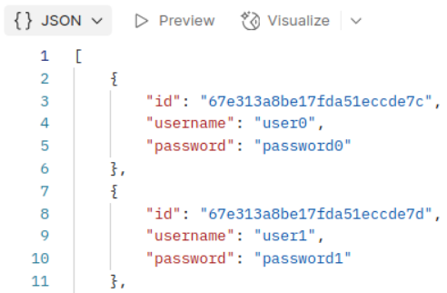
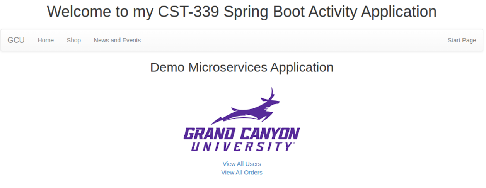
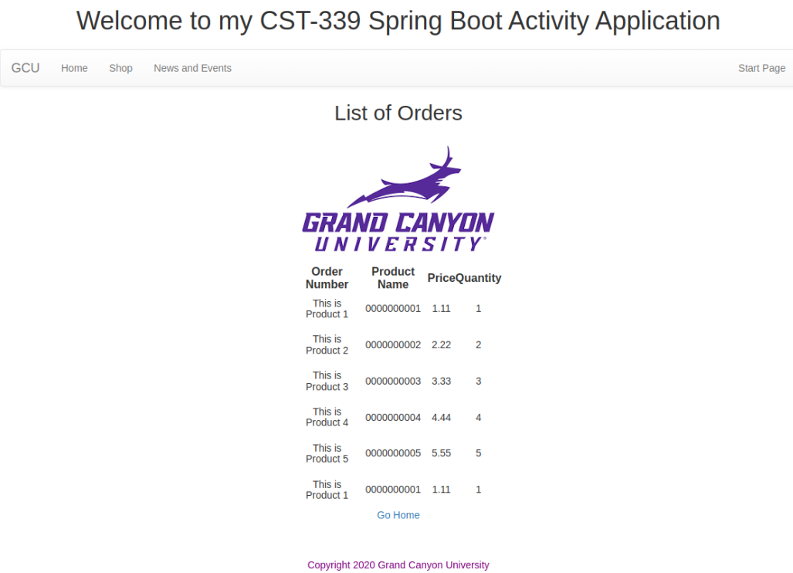
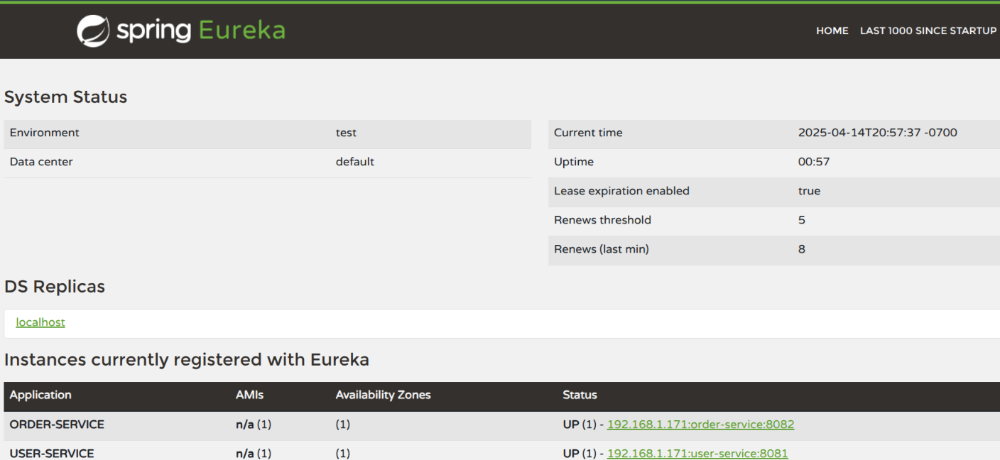
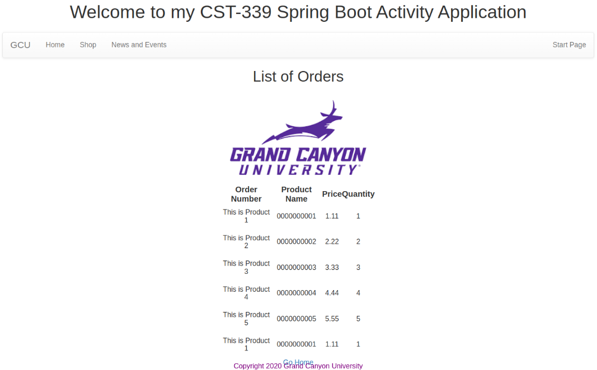

# CST339 - Activity 7 - Microservices

- Date: *2025-4-23*
- Author: **Ashley Barron**

## Introcution:
- This activity will provide the following:
    - Describe microservices and how they differ from traditional monolithic architectures
    - Describe the challenges when moving from traditional monolithic architectures to a microservice architecture style
    - Examine the application of the Christian worldview within programming

## Screenshots
### Part 1: Building a Web Application That Consumes Microservices
- These are the screenshots of the Microservice calls

- This is a screenshot of the Orders Page

- These are the screenshots of the Overall Microservice Application

## Part 2:  Integrating a REST Service Registry and Discovery Service
- These are the Eureka Screenshots

## Eureka - Integrating a REST Service Registry and Discovery Service
- Create a new Spring Boot Project
    - Spring Eureka Server
    - Spring Boot Actuator
- Update application.properties

## Eureka Dashboard Execution and Test
- http://localhost:8761/

### Eureka Services
- Copy Topics 7-1 to 7-2
- Make appropriate updates to POM files
- Update application.properties
- Update TestController class in Topic 7-2c

**NOTE:  @EnableEurekaClient Annotation is no longer required

- Eureka App

- Eureka Users

- Eureka Orders

## Research Questions
### Research Questions: For traditional ground students, answer the following questions in a Microsoft Word document:

1. Research microservices. Describe what they are. How does this architecture style differ from traditional monolithic architectures?

2. Research microservices. What are 5 challenges you might encounter when modifying a monolithic architecture to this architecture style?

### Research Answers:
1. Software can be designed using microservices, which are groups of tiny, independent services, each in charge of a particular task.  It is possible to build, implement, and expand these services independently.  The entire application is constructed as a single unit in traditional monolithic architecture, which makes it more difficult to grow or update separate components.  More flexibility, autonomous teamwork, and the ability to use different technologies for distinct services are all made possible by microservices.

2. There may be a number of difficulties while switching from a monolithic architecture to microservices.  First, it might be difficult and time-consuming to divide a monolithic software into separate services.  Second, since each microservice could require its own database, data administration becomes more challenging and requires careful design to prevent data inconsistencies.  Third, since services now need to communicate with each other over a network, problems like message failures and latency can arise.  Fourth, the more services that must be tracked and managed, the more complex deployment and monitoring become.  Lastly, developers have to make sure that services preserve their independence while working together correctly, which may make team coordination more difficult.

## Christian Worldview Component
- Programmers may inadvertently jeopardize user security or privacy when creating database-driven, high-performance apps.  Common problems include unclear consent, unsafe storage of sensitive data, and unauthorized use of data for purposes other than those for which it was intended.

Users are seriously put at danger, for instance, if developers fail to encrypt personal information like credit card numbers or maintain passwords in open text.  The 2019 Capital One hack, in which over 100 million customer records were exposed due to improperly setup security, is a well-known example.  This demonstrates how neglecting secure measures can have serious repercussions.

From a Christian perspective, the directive to "love your neighbor as yourself" (Mark 12:31) is reflected in the responsible treatment of user data.  It is an act of honesty and respect to handle other people's information with care.  Reminding management that robust security safeguards the business and fosters long-term trust will help them understand if they are concerned about preventing delays.

A sensitive strategy could be:

 As we advance, we can use lightweight security checks to achieve our objectives without endangering people.  We are reminded in Proverbs 11:3 that "the upright are guided by their integrity."  From the beginning, let's construct with integrity.

Businesses with robust security procedures save millions in breach expenses, according to studies like IBM's 2023 report.  Early problem prevention can eventually save money, time, and reputation.

## Conclusion:
- Our comprehension of microservices and their distinctions from conventional monolithic designs has improved as a result of this activity.  We demonstrated how microservices facilitate more adaptable, scalable, and modular programming by creating and evaluating applications that depend on distinct service components.  We also looked into using Eureka for communication between services and dynamic service discovery.

- Although moving from monolithic systems to microservices presents certain difficulties, such as data management, communication, and deployment, they may be resolved with careful design and planning.  All things considered, microservices facilitate agile development and result in more effective workflows.

- The significance of moral development techniques was brought to light by incorporating a Christian viewpoint.  In order to uphold biblical values and foster trust in the tech community, it is our responsibility as developers to safeguard user data and behave honorably.

