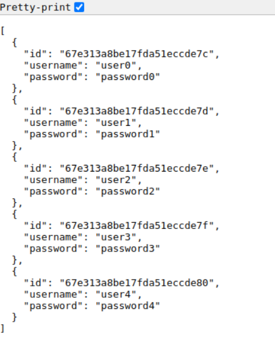

# CST339 - Activity 7 - Microservices

- Date: *2025-4-23*
- Author: **Ashley Barron**

## Introcution:
- This activity will provide the following:
    - Describe microservices and how they differ from traditional monolithic architectures
    - Describe the challenges when moving from traditional monolithic architectures to a microservice architecture style
    - Examine the application of the Christian worldview within programming

## Screenshots
### Part 1: Building a Web Application That Consumes Microservices
- These are the screenshots of the Microservice calls

- This is a screenshot of the Orders Page

- These are the screenshots of the Overall Microservice Application
** pic1
- huh

** pic2
- huh

** pic3
- huh

## Part 2

## Research Questions
### Research Questions: For traditional ground students, answer the following questions in a Microsoft Word document:

1. Research microservices. Describe what they are. How does this architecture style differ from traditional monolithic architectures?

2. Research microservices. What are 5 challenges you might encounter when modifying a monolithic architecture to this architecture style?

### Research Answers:
1. *lpjk

2. *jijgt

## **CHRISTIAN WORLDVIEW COMPONENT***!!!!
- *hjjssj

## Conclusion:
- *jij

